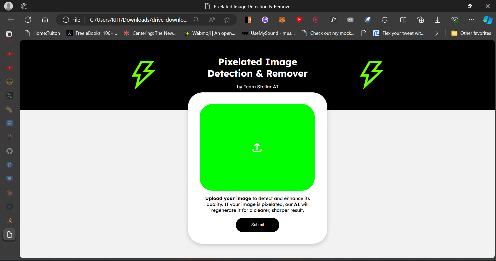

# Pixelated Image Detection & Remover

This project is a web application that detects pixelated images and removes pixelation using AI models. It's built with Flask and TensorFlow, providing an easy-to-use interface for users to upload images and process them.

## Features

- Detect pixelated images
- Remove pixelation from detected images
- User-friendly web interface
- Download processed images

## Prerequisites

Before you begin, ensure you have met the following requirements:

- Python 3.7+
- tensorflow
- Flask

## Installation

1. Clone the repository:
2. Activate Virtual Env : source virvenv/bin/activate  # On Windows use virvenv\Scripts\activate
3. Install the required packages: pip install -r requirements.txt

## Usage

1. Start the Flask application: py app.py
2. Open a web browser and navigate to `http://localhost:5000`
3. Use the web interface to:
- Upload an image
- Click "Submit" to detect pixelation
- If pixelation is detected, the "Remove Pixelation" button will become active
- Click "Remove Pixelation" to process the image
- Download the processed image using the "Download" button

##  Our Team 
1. Anurag Prasoon (Team Leader) (github.com/anuragprasoon)
2. Ananya Jyoti
3. Ashish Pothal
4. Shubham Prakash
5. Vidisha Agrawal 
